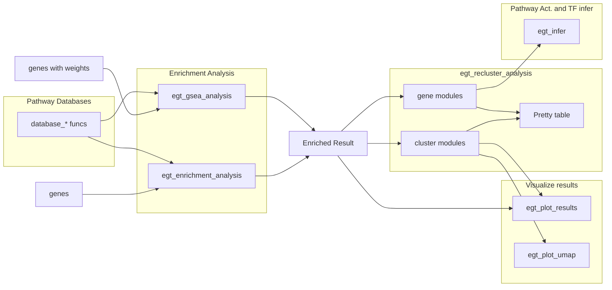

# EnrichGT 0.7

**EnrichGT \<-** Fast, light weight enrichment analysis + insightful re-clustering results make all results explainable + Pretty HTML tables, Just in **ONE** package, 

Please see the package website: <https://zhimingye.github.io/EnrichGT/>


### Install

``` r
install.packages("pak")
pak::pkg_install("ZhimingYe/EnrichGT")
```

### WorkFlows



