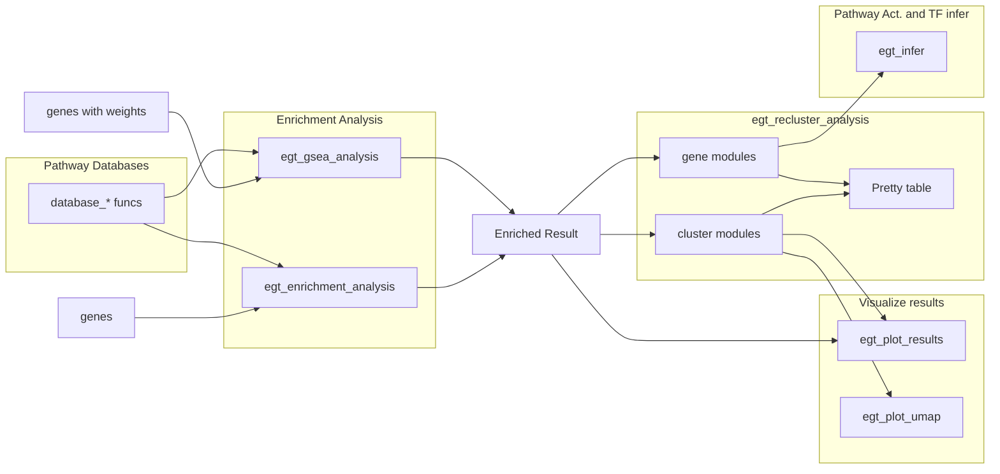

# EnrichGT 0.8

**EnrichGT \<-** Fast, light weight enrichment analysis + insightful re-clustering results make all results explainable + Pretty HTML tables, Just in **ONE** package, designed for researchers in wet-labs. 

Please see the package website for more info: <https://zhimingye.github.io/EnrichGT/>

> [!IMPORTANT]
> The primary goal of EnrichGT is to provide researchers in wet labs, who have been busy all day, with quick and insightful biological interpretations from dry lab data to support their experiments. Therefore, all computational methods employed are relatively straightforward and pragmatic. For example, C++ based ORA enrichment function, GSEA only using fgsea output without more analysis, use only vocabulary frequency matrix for re-enrichment instead of term's similarity, and more... Its purpose is to offer a “quick overview”. After this initial overview, you can use more widely recognized tools to generate statistically rigorous results (not necessary though). However, don’t misunderstand—this does not mean that the statistical processes in EnrichGT are incorrect. I’ve made every effort to ensure their accuracy; they are just less refined. Additionally, the tool has been tested in most typical scenarios, but extreme cases cannot be entirely ruled out.


### Install

``` r
install.packages("pak")
pak::pkg_install("ZhimingYe/EnrichGT")
```

### WorkFlows



