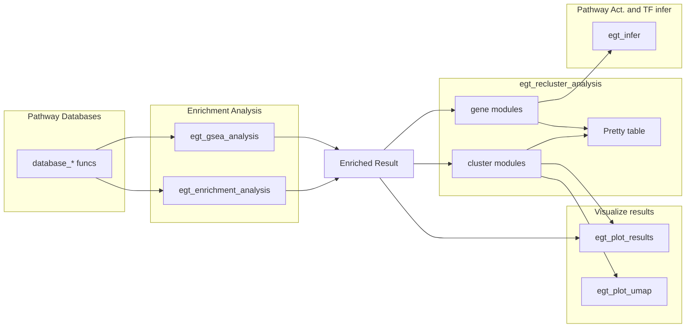

# EnrichGT 0.5

**EnrichGT \<-** Fast, light weight enrichment analysis + explainable re-clustered HTML tables

Please see the package website: <https://zhimingye.github.io/EnrichGT/>


-   Efficient C++-based functions for rapid enrichment analysis;

-   Simple input format, empowering new bioinformatic users;

-   Re-clustering of enriched results provides clear and actionable insights

-   User-friendly HTML output docs that is easy to read and interpret




# Install EnrichGT

``` r
install.packages("pak")
pak::pkg_install("ZhimingYe/EnrichGT")
```

or

``` r
install.packages("devtools")
library(devtools)
install_github("ZhimingYe/EnrichGT")
```
