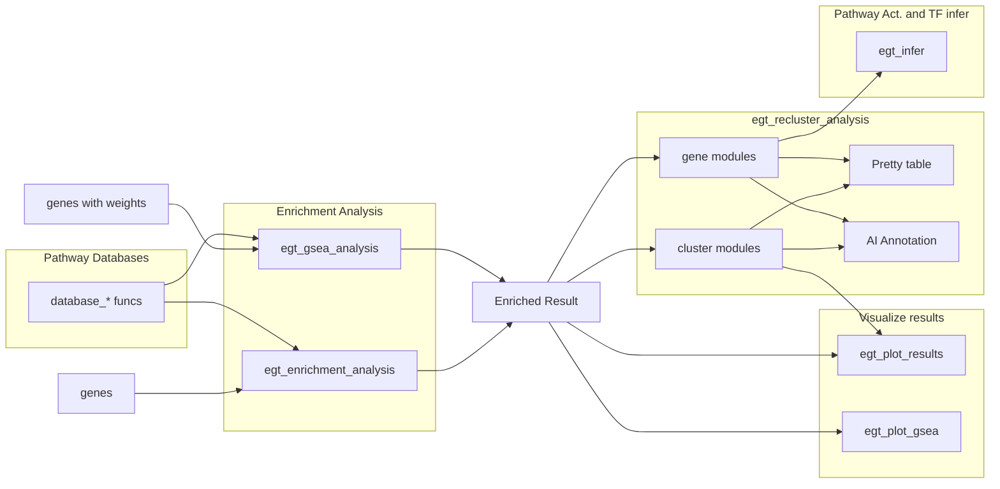

# EnrichGT <a href="https://zhimingye.github.io/EnrichGT/"></a>

**EnrichGT \<-** Fast, light weight enrichment analysis + insightful re-clustering results make all results explainable + Pretty HTML tables, Just in **ONE** package, designed for researchers in wet-labs. Supported databases including GO, KEGG, Reactome, MsigDB + AI based (LLM) result annotations and more ... 


Please see the package website for more info: <https://zhimingye.github.io/EnrichGT/>

- Efficient C++-based functions for rapid enrichment analysis

- Simple input format, empowering non-pro users

- Re-clustering of enriched results provides clear and actionable insights

- User-friendly HTML output that is easy to read and interpret

- AI based (LLM) result annotations

- Do a series of things just in ONE package


### Install

``` r
install.packages("pak")
pak::pkg_install("ZhimingYe/EnrichGT")
```

### WorkFlows

