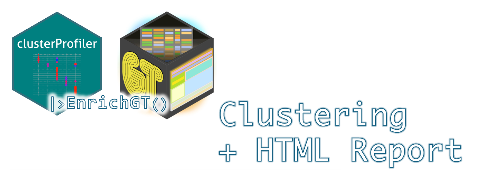

# EnrichGT

## OverView



### Installation

``` r
library(devtools)
install_github("ZhimingYe/EnrichGT")
```

### Help

Please see `Articles` for examples and further help.

------------------------------------------------------------------------

## Why EnrichGT?

### Challenges in Biological Gene Enrichment Analysis

Gene enrichment analysis can often be misleading due to the redundancy within gene set databases and the limitations of most enrichment tools. Many tools, by default, only display a few top results and fail to filter out redundancy. This can result in both biological misinterpretation and valuable information being overlooked.

For instance, high expression of certain immune genes can cause many immune-related gene sets to appear overrepresented. However, a closer look often reveals that these gene sets are derived from the same group of genes, which might represent only a small fraction (less than 10%) of the differentially expressed genes (DEGs). What about the other 90%? Do they hold no biological significance?

### Current Solutions

`EnrichGT` is based on **clusterProfiler**. **clusterProfiler** is one of the most powerful tools in R for enrichment analysis. It's designed with pathway redundancy in mind and includes the `clusterProfiler::simplify` function to address this issue. This method, based on **GOSemSim** for GO similarity evaluation, is scientifically robust and highly effective.

However, there are some drawbacks:

-   GOSemSim is not fast, particularly when dealing with large or complex gene sets.

-   It doesn't support databases like KEGG or Reactome.

Using GOSemSim to measure the semantic similarity between pathways is, theoretically, the best way to tackle redundancy. However, in practical cases—especially in experimental bioinformatics validation—researchers are more focused on the genes behind these pathways rather than the pathways themselves.

### Alternative Approaches

Although clustering pathways based on gene overlap has received some criticism, it remains a viable approach in many situations. For this reason, I developed **BioThemeFinder** a few years ago to solve this problem. However, the tool is so awful (I am poor in coding...)

Today, two excellent alternatives exist:

-   **simplifyEnrichment**: This package is more scientifically rigorous (based on semantic similarity) and creates beautiful visualizations. It also doesn't support databases like KEGG or Reactome.
-   **aPEAR**: A simpler and faster tool that better aligns with practical needs, making it my preferred choice.

However, both of these tools have a common limitation: their visualizations are optimized for publication purposes rather than for exploratory research. I often find myself exporting CSV files or struggling with RStudio's preview pane to fully explore enrichment tables. This inspired me to develop a more efficient solution. Also, they are slow. Please see the [benchmark article](https://zhimingye.github.io/EnrichGT/articles/c_benchmark.html).

### Goals of This Package

The main purpose of developing this package is to provide a **lightweight and practical solution** to the problems mentioned above. Specifically, this package aims to:

1.  **Cluster enrichment results** based on hit genes or core enrichment from GSEA using term frequency analysis (from the output of the powerful `clusterProfiler`). This provides a clearer view of biological relevance by focusing on the genes that matter most.

2.  **Visualize results** using the **Posit PBC's `gt` package**, which offers two key advantages:

    -   **Improved readability** compared to traditional tables, making it easier to interpret results.
    -   **HTML-based output** that allows for internal searching and filtering, making exploration more user-friendly.

3.  **Seamless Integration with Publishing Tools** : Another significant advantage of using the `gt` package is its seamless integration with modern publishing systems like **rmarkdown** and **quarto**. This ensures that your results can be easily shared and published in a professional format, while also allowing for interactive exploration during the research phase.

------------------------------------------------------------------------

If you're tired of redundant pathways cluttering your enrichment results or spending too much time on computational bottlenecks, this package is here to help.
